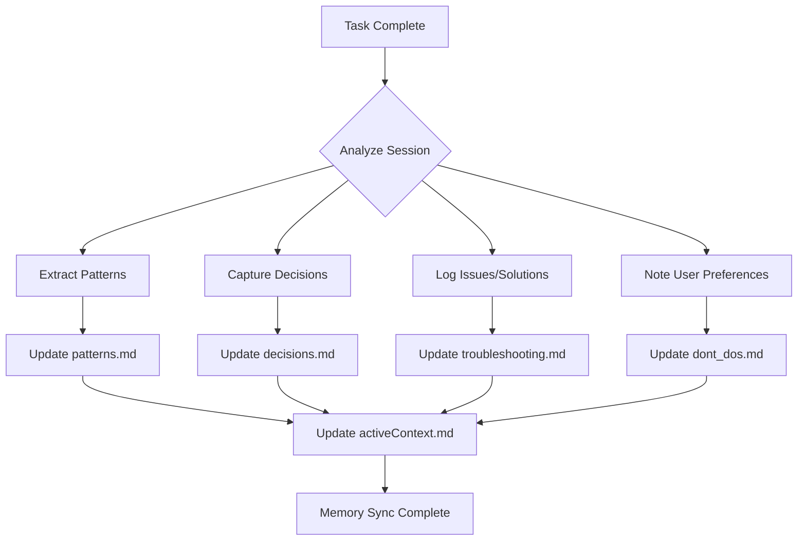

# Memory Auto-Updater Middleware

## 🎯 Purpose
Automatically update all memory bank files after task completion, capturing learnings, patterns, decisions, and user feedback for future sessions.

## 🔄 Trigger Points

Automatically triggered:
1. **After workflow completion** - Update with task learnings
2. **On user interruption** - Capture "don't do that" feedback
3. **On error/failure** - Document troubleshooting solutions
4. **On pattern discovery** - Save reusable patterns
5. **On architectural decision** - Record design choices

## 📁 Memory Files to Update

### 1. CLAUDE-activeContext.md
```markdown
## Latest Session Update
Date: [YYYY-MM-DD HH:MM]
Task: [What was completed]
Status: [Success/Partial/Failed]
Key Changes: [List of changes]
Next Steps: [If any]
```

### 2. CLAUDE-patterns.md
```markdown
## New Pattern Discovered
Pattern Name: [Descriptive name]
Category: [Type of pattern]
Description: [What it solves]
Implementation: [Code example]
When to Use: [Conditions]
Files: [Where it was applied]
```

### 3. CLAUDE-decisions.md
```markdown
## Architecture Decision Record #[N]
Date: [YYYY-MM-DD]
Context: [Why decision was needed]
Decision: [What was decided]
Rationale: [Why this approach]
Consequences: [Impact/trade-offs]
Alternatives: [Other options considered]
```

### 4. CLAUDE-troubleshooting.md
```markdown
## Issue Resolution #[N]
Problem: [Error/issue description]
Symptoms: [What was observed]
Root Cause: [Why it happened]
Solution: [How it was fixed]
Prevention: [How to avoid]
Related Files: [Affected files]
```

### 5. CLAUDE-dont_dos.md (NEW)
```markdown
## User Feedback Entry
Date: [YYYY-MM-DD]
Context: [What was being done]
User Feedback: [Exact user statement]
Learned: [What to avoid]
Category: [Type of don't]
```

## 🚀 Execution Flow



## 📝 Update Templates

### Pattern Detection
```python
def detect_patterns(code_changes):
    patterns = []

    # Check for common patterns
    if "async/await" in code_changes:
        patterns.append({
            "name": "Async Handler Pattern",
            "category": "Concurrency",
            "example": code_changes["async_example"]
        })

    if "try/catch" in code_changes:
        patterns.append({
            "name": "Error Boundary Pattern",
            "category": "Error Handling",
            "example": code_changes["error_example"]
        })

    return patterns
```

### Decision Capture
```python
def capture_decisions(workflow_context):
    decisions = []

    # Extract architectural choices
    if workflow_context.get("database_choice"):
        decisions.append({
            "type": "Database Selection",
            "choice": workflow_context["database_choice"],
            "rationale": workflow_context["db_rationale"]
        })

    if workflow_context.get("framework_choice"):
        decisions.append({
            "type": "Framework Selection",
            "choice": workflow_context["framework_choice"],
            "rationale": workflow_context["framework_rationale"]
        })

    return decisions
```

### User Feedback Processing
```python
def process_user_feedback(user_message):
    dont_keywords = [
        "don't", "stop", "no", "not like that",
        "wrong", "avoid", "never", "skip"
    ]

    if any(keyword in user_message.lower() for keyword in dont_keywords):
        return {
            "type": "negative_feedback",
            "message": user_message,
            "timestamp": datetime.now(),
            "context": get_current_context()
        }

    return None
```

## 🎯 Smart Update Rules

### 1. Deduplication
- Check if pattern already exists before adding
- Merge similar troubleshooting entries
- Update existing decisions rather than duplicate

### 2. Categorization
- Auto-categorize patterns by type
- Group decisions by component
- Organize troubleshooting by error type

### 3. Prioritization
- Mark critical learnings with ⚠️
- Highlight frequently used patterns with ⭐
- Flag security-related items with 🔒

## 📊 Memory Update Format

### Minimal Update (Quick Task)
```markdown
## Quick Update - [Task Name]
- ✅ Completed: [What was done]
- 📝 Learned: [Key takeaway if any]
- ⏭️ Next: [Follow-up if needed]
```

### Full Update (Complex Task)
```markdown
## Comprehensive Update - [Task Name]

### 🎯 Task Summary
- **Objective**: [What was requested]
- **Approach**: [How it was solved]
- **Outcome**: [Result]

### 📚 Learnings Captured
- **Patterns**: [X] new patterns documented
- **Decisions**: [Y] architectural choices recorded
- **Issues**: [Z] problems solved and documented

### 💡 Key Insights
1. [Important learning 1]
2. [Important learning 2]

### 🔄 Memory Files Updated
- ✅ activeContext.md - Session summary
- ✅ patterns.md - [Specific patterns]
- ✅ decisions.md - [Specific decisions]
- ✅ troubleshooting.md - [Issues resolved]
- ✅ dont_dos.md - [User preferences]
```

## 🚨 Interruption Handling

When user interrupts with correction:

```python
def handle_interruption(user_input, current_action):
    # Immediate capture
    feedback = {
        "timestamp": now(),
        "action_interrupted": current_action,
        "user_statement": user_input,
        "classification": classify_feedback(user_input)
    }

    # Quick update to dont_dos.md
    update_dont_dos(feedback)

    # Acknowledge learning
    return "Got it! I'll remember not to {action} in the future."
```

## 🔄 Auto-Sync Schedule

### Immediate Updates (Real-time)
- User corrections/interruptions
- Critical errors discovered
- Security issues found

### Batch Updates (End of task)
- Pattern collection
- Decision documentation
- Troubleshooting solutions
- Session summary

### Periodic Updates (Every 30 min)
- Active context refresh
- Memory consolidation
- Deduplication run

## 📈 Learning Metrics

Track and report:
- Patterns discovered per session
- Decisions made per task
- Issues resolved count
- User corrections received
- Memory growth rate

## 🎯 Integration with systemcc

The memory updater is automatically called:

```markdown
Phase 8: Memory Bank Update (AUTO)
━━━━━━━━━━━━━━━━━━━━━━━━━━━━━
📝 Updating memory banks...

✅ Patterns: 3 new patterns added
✅ Decisions: 2 choices documented
✅ Troubleshooting: 1 issue resolved
✅ User Preferences: 0 new don'ts
✅ Context: Session summary saved

Memory sync complete! Learning preserved for future sessions.
```

## 🔒 Privacy & Security

- Never store sensitive data (passwords, keys)
- Sanitize user inputs before storage
- Exclude private information from patterns
- Mark security-related items appropriately

## 📝 Example Execution

```bash
# After task completion
Claude: Task completed successfully!

[AUTO-TRIGGERED: Memory Update]
📝 Capturing learnings...

New Patterns Found:
• React Hook optimization pattern
• API error handling pattern

Architectural Decision:
• Chose PostgreSQL for better JSON support

Issue Resolved:
• Fixed TypeScript inference issue with generics

Memory banks updated for future sessions!
```

## 🔗 Related Files
- `middleware/memory-bank-synchronizer.md`
- `ClaudeFiles/memory/CLAUDE-*.md` files
- `commands/systemcc/11-MEMORY-UPDATE.md`

---

*Automatic learning capture - making every session smarter than the last.*