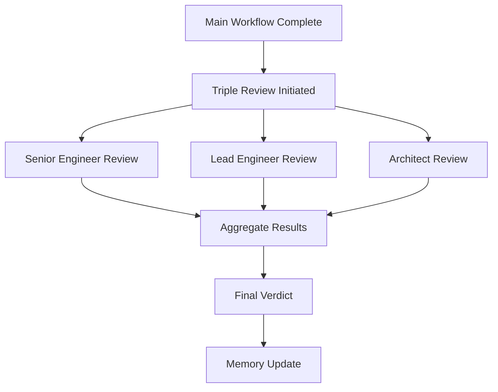

# Triple Review Orchestrator - Post-Execution Quality Check

## 🎯 Purpose
Execute three parallel code reviews by Senior Engineer, Lead Engineer, and Software Architect after main workflow completion. This provides a final quality gate with different perspectives.

## ⚡ Execution Mode: PARALLEL & ULTRA-FAST

All three reviewers run **simultaneously** for maximum speed:
- Total time: 5 minutes (all parallel)
- Each reviewer: Independent 5-minute review
- Results: Aggregated and summarized

## 🔄 Workflow Sequence



## 📋 Review Trigger Conditions

Automatically triggered when:
1. **Complete System Workflow** finishes (6-agent)
2. **Orchestrated Workflow** finishes (3-agent)
3. **AI Dev Tasks Workflow** implementation complete
4. **Any significant code changes** are made

Skip review when:
- Only documentation updates
- Configuration-only changes
- Emergency hotfixes (time critical)
- User explicitly says "skip review"

## 🚀 Execution Instructions

### Step 1: Initiate Parallel Reviews

```markdown
🔍 POST-EXECUTION REVIEW INITIATED
━━━━━━━━━━━━━━━━━━━━━━━━━━━━
⚡ Running 3 parallel reviews...

[PARALLEL EXECUTION]
├─ 👨‍💻 Senior Engineer: Code quality & best practices
├─ 👩‍💼 Lead Engineer: Architecture & technical debt
└─ 🏗️ Architect: System integration & patterns

⏱️ Estimated time: 5 minutes
```

### Step 2: Execute Reviews Simultaneously

Each reviewer independently analyzes:
- **Senior**: Code quality, readability, maintainability
- **Lead**: Design patterns, technical debt, team impact
- **Architect**: System integration, enterprise patterns

### Step 3: Aggregate Results

```markdown
## 📊 TRIPLE REVIEW RESULTS
━━━━━━━━━━━━━━━━━━━━━━━━

### 👨‍💻 Senior Engineer
Status: [PASSED/NEEDS_WORK]
Key Points: [Summary]

### 👩‍💼 Lead Engineer
Status: [APPROVED/REFACTOR_NEEDED]
Key Points: [Summary]

### 🏗️ Architect
Status: [CERTIFIED/REDESIGN_NEEDED]
Key Points: [Summary]

### 🎯 OVERALL VERDICT: [READY/NEEDS_FIXES]
```

## 🔀 Decision Matrix

| Senior | Lead | Architect | Final Verdict | Action |
|--------|------|-----------|---------------|--------|
| PASSED | APPROVED | CERTIFIED | ✅ READY | Ship it! |
| PASSED | APPROVED | REDESIGN | ⚠️ NEEDS_FIXES | Fix architecture |
| PASSED | REFACTOR | CERTIFIED | ⚠️ NEEDS_FIXES | Refactor design |
| NEEDS_WORK | ANY | ANY | ⚠️ NEEDS_FIXES | Fix code issues |
| ANY | ANY | REDESIGN | 🛑 BLOCKED | Major redesign needed |

## 📝 Output Format

### Success Case
```markdown
✅ POST-EXECUTION REVIEW COMPLETE
━━━━━━━━━━━━━━━━━━━━━━━━━━━━━━━

🏆 All reviewers approved the implementation!

**Highlights:**
• Clean code with good separation of concerns
• Scalable architecture following best practices
• Proper integration with existing systems

**Minor Suggestions:**
• Consider adding more unit tests
• Document the new API endpoints

Ready for deployment! 🚀
```

### Issues Found Case
```markdown
⚠️ POST-EXECUTION REVIEW - ISSUES FOUND
━━━━━━━━━━━━━━━━━━━━━━━━━━━━━━━━━━

**Critical Issues to Fix:**
• `src/api/auth.ts:45` - Security: Password in plain text
• `src/services/payment.ts:112` - Missing circuit breaker

**Quick Fixes Required:**
1. Encrypt passwords before storage
2. Add circuit breaker to payment gateway calls

Fixing these issues now...
```

## 🔧 Auto-Fix Protocol

If issues are found:
1. **CRITICAL** (Security/Data Loss): Fix immediately
2. **MAJOR** (Bugs/Performance): Fix in same session
3. **MINOR** (Style/Optimization): Log for next session

## 💾 Memory Integration

After review completion:
1. **Update patterns.md** with discovered patterns
2. **Update dont_dos.md** with anti-patterns found
3. **Update decisions.md** with architectural choices
4. **Update troubleshooting.md** with issues fixed

## 🎯 Quality Gates

### Must Pass (Blocking)
- No security vulnerabilities
- No data loss risks
- No breaking changes
- No performance regressions > 20%

### Should Pass (Warning)
- Follow team coding standards
- Maintain test coverage
- Document complex logic
- Handle errors properly

### Nice to Have (Info)
- Optimize for readability
- Reduce complexity
- Improve test coverage
- Enhanced documentation

## 📊 Metrics Tracking

Track and report:
- Review completion time
- Issues found per reviewer
- Fix time for issues
- Patterns discovered
- False positive rate

## 🔄 Continuous Improvement

The review system learns:
1. **Common issues** → Add to pre-checks
2. **False positives** → Adjust criteria
3. **Missed issues** → Enhance checklist
4. **Time delays** → Optimize process

## 🚨 Emergency Override

User can skip reviews by saying:
- "skip review"
- "no review needed"
- "emergency deploy"
- "hotfix mode"

## 🎭 Review Personalities

Each reviewer has distinct focus:
- **Senior**: "Is this maintainable code I'd want to inherit?"
- **Lead**: "Will this scale with our team and product?"
- **Architect**: "Does this fit our system architecture?"

## 📝 Example Execution

```bash
User: /systemcc "add user authentication"
[... main workflow completes ...]

Claude:
🔍 POST-EXECUTION REVIEW INITIATED
━━━━━━━━━━━━━━━━━━━━━━━━━━━━
⚡ Running 3 parallel reviews...

[5 minutes later]

✅ POST-EXECUTION REVIEW COMPLETE
━━━━━━━━━━━━━━━━━━━━━━━━━━━━━━━
🏆 All reviewers approved!

Key strengths:
• Secure JWT implementation
• Clean separation of auth logic
• Proper error handling

Minor suggestion:
• Add rate limiting to login endpoint

Your authentication system is production-ready! 🚀
```

## 🔗 Integration Points

This workflow integrates with:
- `systemcc` main command (auto-triggered)
- Memory bank system (auto-update)
- Error handling system (auto-fix)
- Git workflow (pre-commit)

---

*Fast, parallel, comprehensive - ensuring quality without slowing down development.*